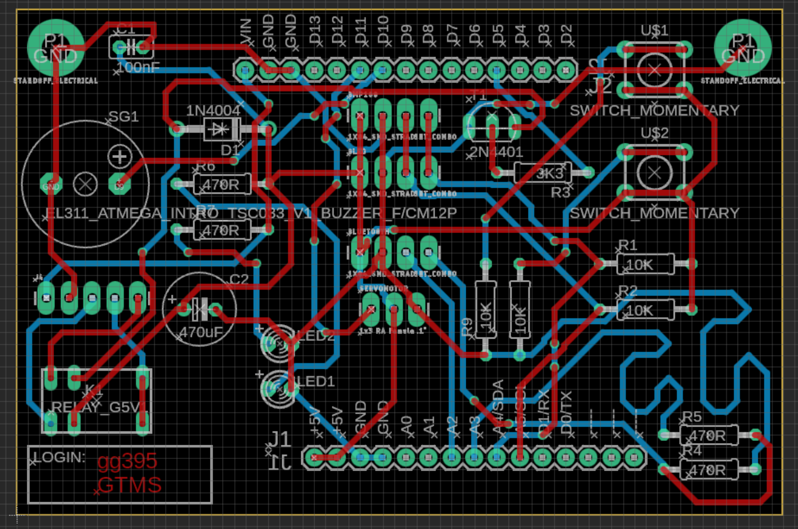
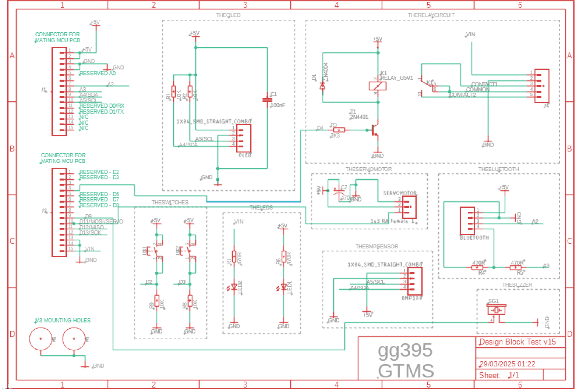
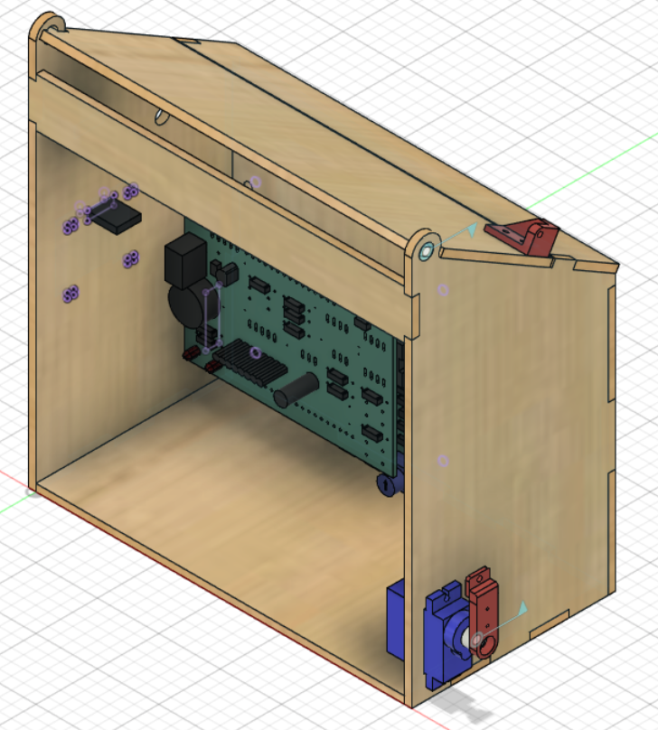

# 🌱 Smart Greenhouse Temperature Monitoring System

<p align="center">
  
</p>

## Overview
The Smart Greenhouse Temperature Monitoring System is an embedded systems project designed to monitor greenhouse temperature in real time and automatically actuate a ventilation mechanism when user-defined thresholds are exceeded.

This project integrates embedded programming, custom PCB design, CAD modelling, mechanical design, and hardware integration into a complete working prototype.

Developed as part of my Electronic & Computer Engineering degree at the University of Kent.


## Features
- Real-time temperature monitoring using a BMP180 sensor
- OLED display with live temperature readings
- Interactive menu system
- User-configurable temperature thresholds
- Automatic servo-controlled window mechanism
- Audible buzzer alerts
- Serial debugging interface


## Technologies Used
### Hardware
- BMP180 Temperature Sensor
- OLED Display (I²C)
- SG90 Servo Motor
- Potentiometer
- Push Buttons
- Buzzer

### Software
- Arduino IDE
- C++
- Autodesk Eagle
- Autodesk Fusion 360

### Skills Demonstrated
- Embedded Systems
- PCB Design
- CAD Modelling
- Electronics
- Sensor Integration
- Firmware Development
- Hardware Debugging


## PCB Design




The PCB was designed in Autodesk Eagle. The design integrates the sensor, OLED display, user controls, servo interface, and supporting circuitry while remaining within the project constraints.


## Mechanical Design


Mechanical components were designed in Autodesk Fusion 360.

The assembly includes:

- Servo mount
- Roof mount
- Integrated enclosure
- Window actuation mechanism


## User Interface

### Monitoring Screen


Displays the current temperature and selected threshold.

### Menu


Allows users to configure temperature thresholds using push buttons.


## Firmware
The firmware is located in the `firmware/` directory and implements:

- Sensor acquisition
- OLED interface
- User menu
- Servo control
- Buzzer alerts
- Serial debugging


## Project Structure
```text
firmware/
pcb/
cad/
images/
docs/
```

## Future Improvements
- Wi-Fi connectivity
- Cloud dashboard
- Humidity monitoring
- Data logging
- Mobile application
- Predictive climate control using machine learning


## What I Learned

This project strengthened my understanding of the complete embedded systems design process, including:

- PCB design and validation using Autodesk Eagle
- Mechanical design using Fusion 360
- Integrating hardware and software into a complete system
- Designing user interfaces for embedded devices
- Debugging hardware and firmware interactions
- Iterative engineering design and testing

## Engineering Challenges
During development I encountered several practical engineering challenges:

- PCB routing became difficult due to limited board space, requiring manual trace optimisation.
- Initial I²C communication issues were resolved by adding the appropriate pull-up resistors.
- Servo instability was addressed through power supply improvements and software timing adjustments.
- Sensor calibration was refined through iterative testing and validation.

These challenges reinforced the importance of systematic debugging and iterative engineering design.


## Author
Gouri Girish Nair
Electronic & Computer Engineering
University of Kent
